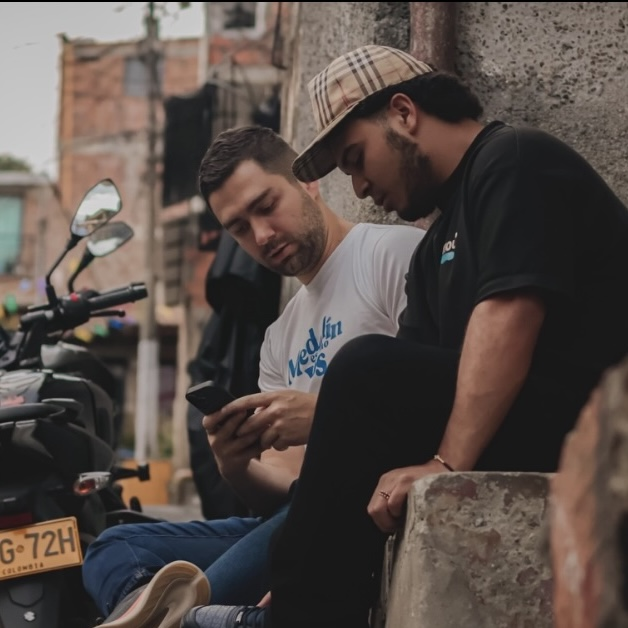
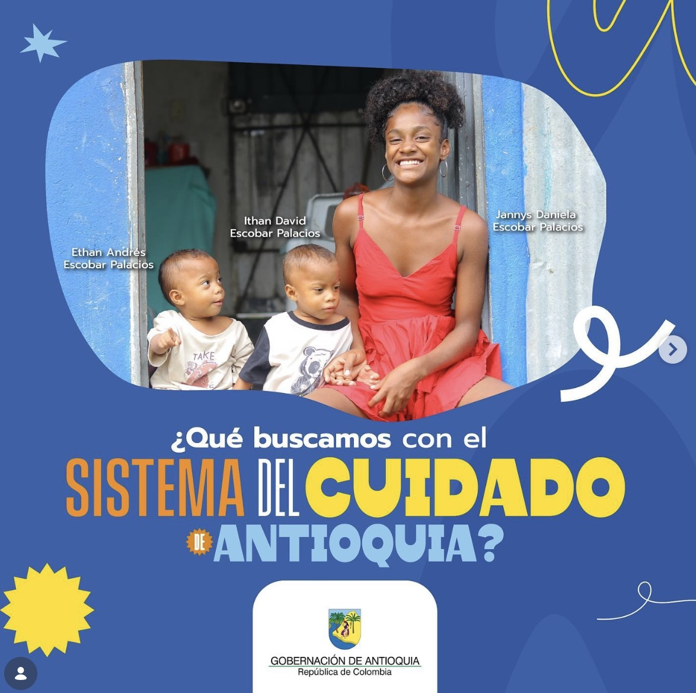
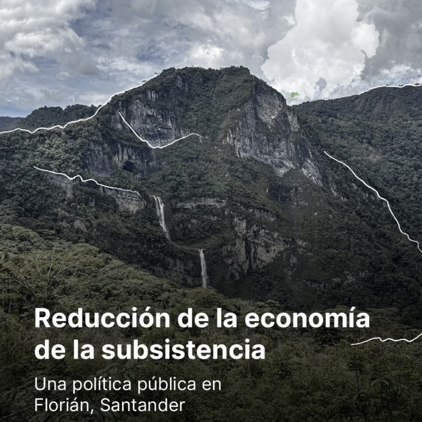
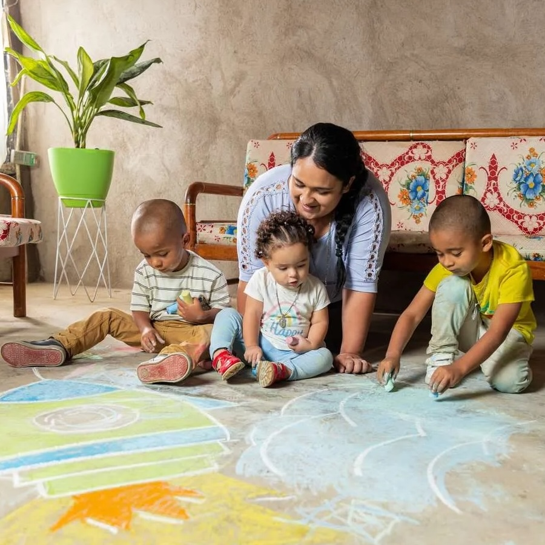

# Centro de Valor Público

El Centro de Valor Público de la Universidad EAFIT produce investigación aplicada, diseño de políticas y evaluación de programas para gobiernos, organizaciones internacionales y el sector privado. El Centro opera a través de cinco iniciativas temáticas —seguridad y justicia, gobierno y democracia, desarrollo económico, equidad y desarrollo social, e innovación social— con un equipo de profesores coordinadores, gerentes de proyectos e investigadores.

Para la lista completa de publicaciones, notas de política y perfiles del equipo, visite la [página del Centro en EAFIT](https://www.eafit.edu.co/centros-estudio-incidencia/valor-publico).

Los proyectos a continuación ilustran lo que hace el Centro y cómo trabaja.

---

## Parceros Creadores

**Aliado:** Secretaría de Juventud de Medellín

Cada año en Medellín, miles de jóvenes abandonan el colegio y no logran encontrar trabajo estable. Un subconjunto de ellos —identificable mediante encuestas de tamizaje— enfrenta un riesgo elevado de reclutamiento por organizaciones criminales. Parceros Creadores filtra jóvenes en situación de vulnerabilidad en toda la ciudad, identifica a quienes no estudian, no trabajan y están en riesgo, y les ofrece intervenciones psicológicas y vocacionales estructuradas.

Lo que distingue este proyecto es el proceso de producción detrás de la política. El programa no entrega una intervención fija esperando resultados. Trata cada año como un experimento diseñado para responder una pregunta específica, y el gobierno ajusta el programa con base en lo que muestra la evidencia.

En 2024, el Centro realizó una evaluación aleatorizada con aproximadamente 1.500 jóvenes, comparando terapia cognitivo-conductual (sesiones grupales e individuales) contra una intervención de coaching experiencial. La TCC produjo las mayores reducciones en depresión y ansiedad, y los mayores aumentos en interés por trabajar y estudiar. En 2025, un segundo experimento con 4.000 jóvenes (la mitad tratados) comparó sesiones grupales vs. individuales de TCC y varió el número de sesiones para identificar la dosis óptima. Trece sesiones individuales generaron el mayor impacto y la mejor relación costo-beneficio. En 2026, el programa atenderá a 1.600 jóvenes con 13 sesiones individuales e incorporará un componente de reducción de daños para abordar el consumo de drogas.

El resultado es un programa de gobierno que mejora con cada iteración porque la evaluación está integrada en el diseño —no se añade después.

---

## Sistema del Cuidado de Antioquia

**Aliado:** Gobernación de Antioquia

En Antioquia, las mujeres dedican hasta 14 horas diarias al trabajo de cuidado no remunerado y asumen la responsabilidad exclusiva en el 65% de los hogares. Los hombres participan marginalmente. Esta asimetría restringe directamente la participación laboral femenina: las mujeres que pasan el día cuidando niños, adultos mayores y otros miembros del hogar no pueden acceder a empleo remunerado. El resultado es un ciclo en el que la distribución desigual del tiempo produce dependencia económica, erosiona la autonomía femenina y reduce la productividad agregada.

El Sistema del Cuidado interviene a nivel estructural. En lugar de compensar a las mujeres por la carga que ya llevan, el sistema redistribuye la responsabilidad del cuidado a través de cuatro canales: infraestructura física (centros de cuidado y espacios comunitarios), formación y profesionalización de cuidadores, programas de transformación cultural (incluyendo la promoción de masculinidades corresponsables y educación en economía del cuidado) y coordinación intersectorial entre agencias gubernamentales.

El diseño apunta a las condiciones institucionales y culturales que sostienen la desigualdad de género —no a los síntomas. Los efectos esperados se acumulan en el tiempo: las horas liberadas se traducen en ingreso al mercado laboral, lo que genera ingresos, lo que modifica el poder de negociación en el hogar, lo que altera la distribución del cuidado en la siguiente generación.

---

## Fortalecimiento municipal a lo largo del oleoducto OCENSA

**Aliado:** OCENSA (Oleoducto Central S.A.)

Cuarenta y nueve municipios se ubican a lo largo de la ruta del oleoducto central de Colombia. La mayoría tiene capacidad administrativa limitada —dificultad para formular proyectos ante mecanismos de financiación nacional, planificación territorial débil y equipos técnicos reducidos. El enfoque convencional de responsabilidad social corporativa en zonas extractivas transfiere recursos. Este proyecto transfiere capacidades.

El Centro capacitó a funcionarios municipales en formulación de proyectos bajo mecanismos de financiación pública, planificación territorial y gestión fiscal. La lógica sigue un principio bien documentado en desarrollo: las mejoras más duraderas en el bienestar local provienen no de inyectar dinero, sino de fortalecer las instituciones que deciden cómo se gasta el dinero.

Los efectos operan en dos niveles. A nivel institucional, administraciones municipales más fuertes producen gasto público de mayor calidad y ganan legitimidad ante los ciudadanos —dos factores estrechamente asociados con la reducción del conflicto social en zonas extractivas. A nivel comunitario, los procesos de planificación participativa y los mecanismos de rendición de cuentas crean canales estructurados de diálogo entre la empresa y los territorios, reemplazando la negociación ad hoc con rutinas institucionales.

El proyecto cambia las condiciones que producen el subdesarrollo territorial en lugar de compensar sus consecuencias.

---

## Hogares Saludables

**Aliado:** Cementos Argos

La mayoría de las intervenciones de vivienda entregan materiales. Hogares Saludables parte de los mismos objetos físicos —un piso de concreto, un baño, una cocina— pero estructura el proceso para que las familias aprendan a construir, participen en cada etapa y terminen con apropiación sobre su propia transformación. La distinción importa porque determina si la intervención produce una transferencia única o un cambio sostenido en el comportamiento del hogar.

Los resultados confirman el mecanismo. Después de la intervención, los niños se enferman con menos frecuencia, los adultos duermen mejor, el bienestar reportado aumenta y las familias comienzan a invitar personas a sus hogares —algo que muchas evitaban antes. El programa ha mejorado más de 10.000 viviendas y alcanzado a 25.000 personas en Colombia. Se están realizando réplicas en República Dominicana, Puerto Rico, Honduras y Panamá.

Hogares Saludables demuestra que modificar una estructura física puede transformar la salud, la cohesión social y la autopercepción dentro de un hogar —siempre que el proceso esté diseñado para activar la agencia en lugar de entregar caridad.

---

## Trabaje con nosotros

El Centro desarrolla proyectos de investigación aplicada, diseño de políticas y evaluación de programas con gobiernos, organizaciones multilaterales, ONG y empresas privadas. Para consultas, escriba a [stobonz@eafit.edu.co](mailto:stobonz@eafit.edu.co).

[Visite el Centro en EAFIT →](https://www.eafit.edu.co/centros-estudio-incidencia/valor-publico)
