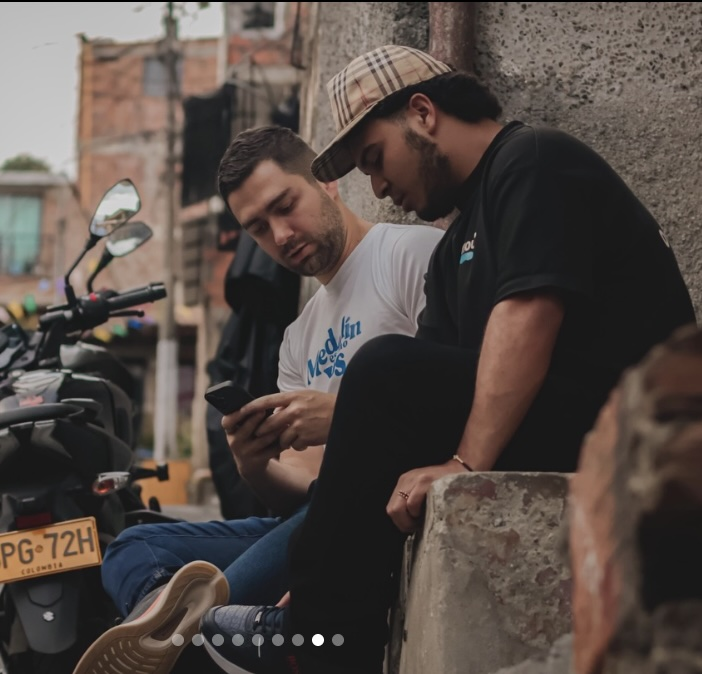
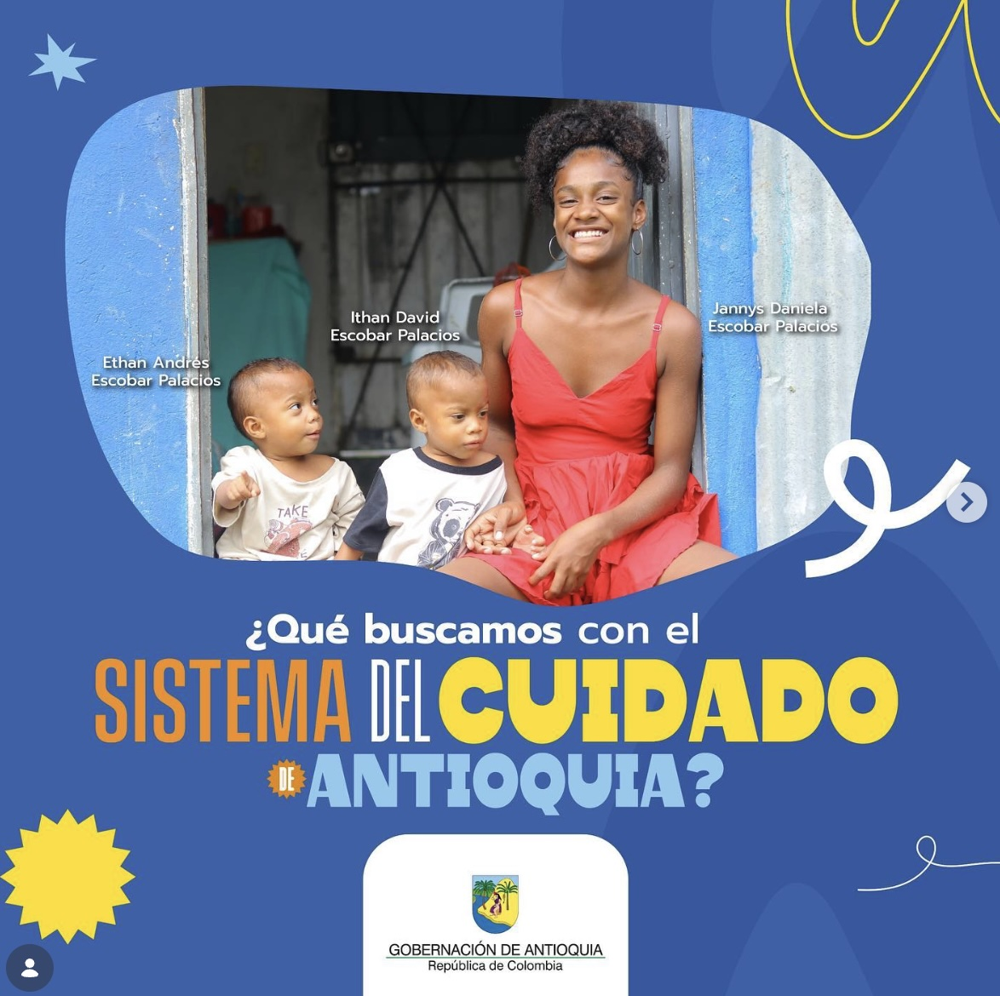
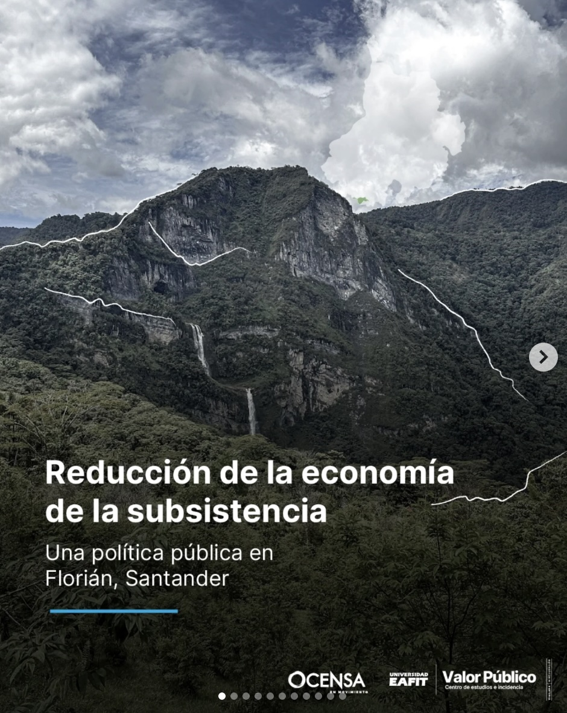
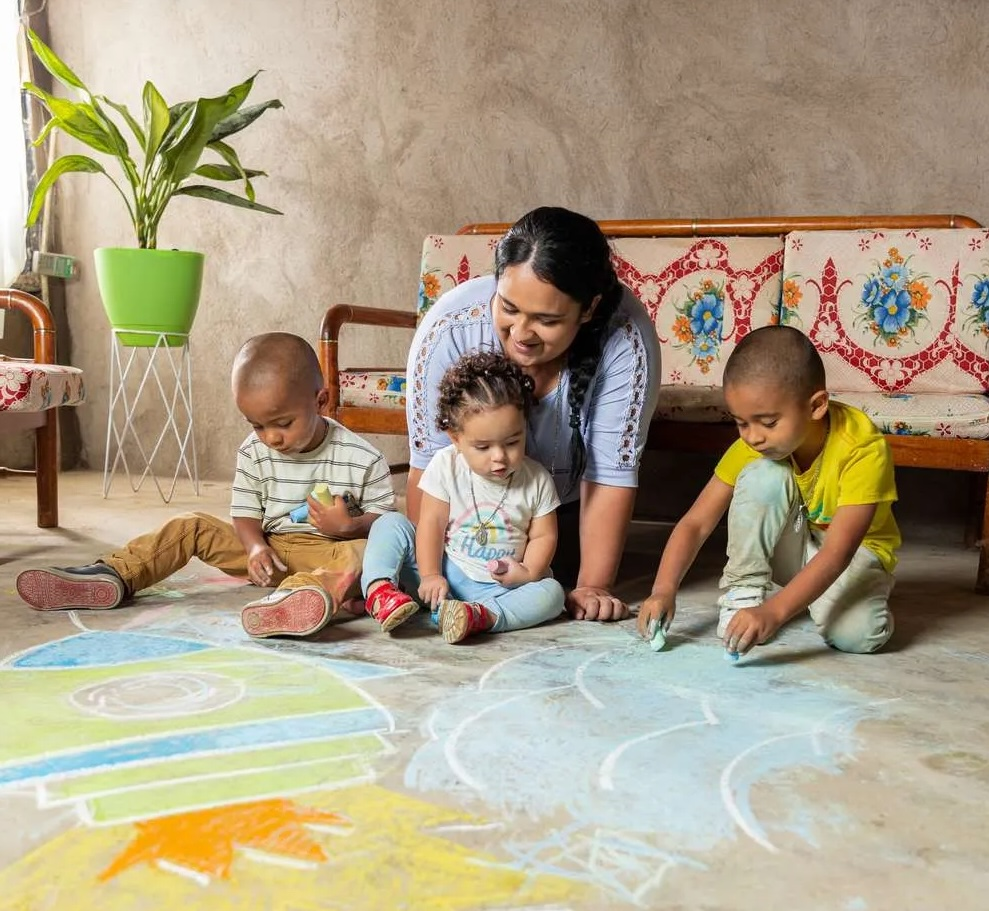

# Centro de Valor Público

The Centro de Valor Público at Universidad EAFIT produces applied research, policy design, and program evaluation for governments, international organizations, and the private sector. The Centro operates across five thematic initiatives — security and justice, government and democracy, economic development, equity and social development, and social innovation — with a team of faculty coordinators, project managers, and research staff.

For the full list of publications, policy notes, and team profiles, visit the [Centro's page at EAFIT](https://www.eafit.edu.co/centros-estudio-incidencia/valor-publico).

The projects below illustrate what the Centro does and how it works.

---

## Parceros Creadores

**Partner:** Secretaría de Juventud de Medellín

Every year in Medellín, thousands of young people leave school and fail to find stable work. A subset of them — identifiable through survey screening — face elevated risk of recruitment by criminal organizations. Parceros Creadores screens disadvantaged youth across the city, identifies those who are not studying, not working, and at risk, and provides structured psychological and vocational interventions.

What makes this project distinctive is the production process behind the policy. The program does not deliver a fixed intervention and hope for results. It treats each year as an experiment designed to answer a specific question, and the government adjusts the program based on what the evidence shows.

In 2024, the Centro ran a randomized evaluation with roughly 1,500 youth comparing cognitive behavioral therapy (group and individual sessions) against an experiential coaching intervention. CBT produced the strongest reductions in depression and anxiety, and the largest increases in interest in work and study. In 2025, a second experiment with 4,000 youth (half treated) tested group versus individual CBT sessions and varied the number of sessions to identify the optimal dosage. Thirteen individual sessions delivered the strongest impact and the best cost-benefit ratio. In 2026, the program will treat 1,600 youth with 13 individual sessions and add a harm-reduction component to address drug use.

The result is a government program that improves with each iteration because evaluation is built into the design — not appended after the fact.

{ .project-photo }

---

## Sistema del Cuidado de Antioquia

**Partner:** Gobernación de Antioquia

In Antioquia, women dedicate up to 14 hours per day to unpaid care work and bear sole responsibility in 65% of households. Men participate marginally. This asymmetry restricts female labor force participation directly: women who spend their day caring for children, elderly relatives, and household members cannot take on paid employment. The result is a cycle in which the unequal distribution of time produces economic dependence, erodes female autonomy, and reduces aggregate productivity.

The Sistema del Cuidado intervenes at the structural level. Rather than compensating women for the burden they already carry, the system redistributes the responsibility for care through four channels: physical infrastructure (care centers and community spaces), training and professionalization of care workers, cultural transformation programs (including promotion of co-responsible masculinities and care economy education), and cross-sector coordination among government agencies.

The design targets the institutional and cultural conditions that sustain gender inequality — not the symptoms. The expected effects accumulate over time: freed hours translate into labor market entry, which generates income, which shifts household bargaining power, which alters the distribution of care in the next generation.

{ .project-photo }

---

## Municipal strengthening along the OCENSA pipeline

**Partner:** OCENSA (Oleoducto Central S.A.)

Forty-nine municipalities sit along the route of Colombia's central oil pipeline. Most have limited administrative capacity — difficulty formulating projects for national funding mechanisms, weak territorial planning, and thin technical staff. The conventional approach to corporate social responsibility in extractive zones transfers resources. This project transfers capabilities instead.

The Centro trained municipal officials in project formulation under public financing mechanisms, territorial planning, and fiscal management. The logic follows a well-documented principle in development: the most durable improvements in local welfare come not from injecting money but from strengthening the institutions that decide how money gets spent.

The effects operate at two levels. At the institutional level, stronger municipal administrations produce higher-quality public spending and gain legitimacy with citizens — two factors closely associated with reduced social conflict in extractive zones. At the community level, participatory planning processes and accountability mechanisms create structured channels for dialogue between the company and the territories, replacing ad hoc negotiation with institutional routines.

The project changes the conditions that produce territorial underdevelopment rather than compensating for its consequences.

{ .project-photo }

---

## Hogares Saludables

**Partners:** Multiple (Colombia, Dominican Republic, Puerto Rico, Honduras, Panama)

Most housing interventions deliver materials. Hogares Saludables starts with the same physical objects — a concrete floor, a bathroom, a kitchen — but structures the process so that families learn to build, participate in every stage, and finish with ownership over their own transformation. The distinction matters because it determines whether the intervention produces a one-time transfer or a sustained change in household behavior.

The results confirm the mechanism. After the intervention, children fall sick less frequently, adults sleep better, reported wellbeing rises, and families begin inviting people to their homes — something many previously avoided. The program has improved over 10,000 homes and reached 25,000 people in Colombia. Replications are running in the Dominican Republic, Puerto Rico, Honduras, and Panama.

Hogares Saludables demonstrates that modifying a physical structure can shift health, social cohesion, and self-perception within a household — provided the process is designed to activate agency rather than deliver charity.

{ .project-photo }

---

## Work with us

The Centro takes on research, consultancy, and evaluation projects with governments, multilateral organizations, NGOs, and private firms. For inquiries, write to [stobonz@eafit.edu.co](mailto:stobonz@eafit.edu.co).

[Visit the Centro at EAFIT →](https://www.eafit.edu.co/centros-estudio-incidencia/valor-publico)
